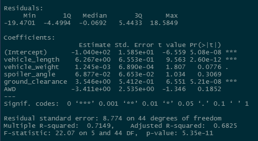
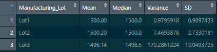
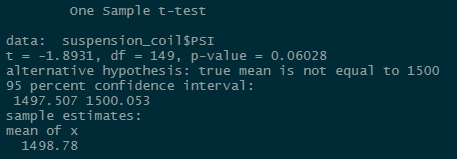
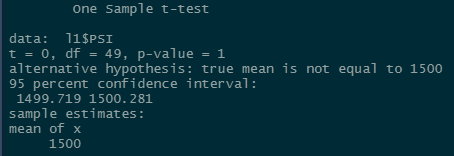
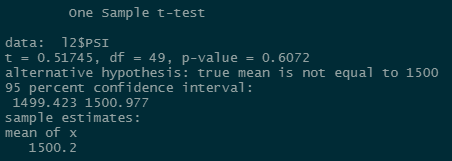
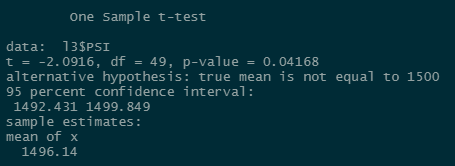

# Module 15 - MechaCar Challenge (R Studio)
## Linear Regression to Predict MPG
The data in `MechaCar_mpg.csv` was analyized using a multiple linear regression in order to determine the impact of multiple variables on the mpg rating of a vehicle.

The variables that are highly likely to have an impact on the vehicle's fuel efficiency (mpg) are `ground_clearance`, and `vehicle_length`, as well as (to a lesser extent) `vehicle_weight`.  For these variables, it can be concluded that the slope of the corresponding linear model is __not__ zero, because a clear correlation can be seen. By looking at the Multiple R-squared value - __0.7149__ - it's clear that this linear regression can effectively predict the mpg of a MechaCar prototype, given these variables.

## Summary Statistics on Suspension Coils
The PSI values in `Suspension_Coil.csv` were summarized by the mean, median, variance, and standard deviation to produce the following table:

The same PSI values were then broken out by lot number, as shown:

The first chart indicates that thre entire set of suspension coils meets the design specification ("PSI variance shall not exceed 100").  However, when grouping the data by lot (as seen in the second chart) it is shown that __Lot 3__ has failed the design specification, because the variance is 170 - which exceeds the allowable variance of 100.

## T-tests on Suspension Coils

T-tests were conducted on the PSI values against an population mean of 1500.  To verify whether there was any statistically significant variation with the lots themselves, the tests were conducted on the entire data set, as well as the lots individually:

### Full Dataset

### Lot 1

### Lot 2

### Lot 3

By looking at the `p-value` for each t-test, and a significance level of 0.05 percent, we can conclude a few things:

1.  For the entire set of suspension coils, as well as Lots 1 and 2 (__p = 0.06028__, __p = 1__, __p = 0.6072__, respectively), we should reject the hypothesis that there is a statistical difference between the observed sample and the population.  In other words, the full sample's mean PSI is within an acceptable range of variation. However, it's quite close.
2.  Given the same set of criteria, Lot 3 (__p = 0.04168__) shows that should accept that there is a statistical significance between this sample and the population.  In other words, the mean PSI of this lot is not within an acceptable range of variation.

## Study Design: MechaCar vs Competition

As an additional study, we would like to know whether MechaCar's size class is acceptable for its fuel efficiency, when compared to the competition.

__Null Hypothesis__: The MechaCar's mean fuel efficiency has no statistical difference to that of competitors in the same volume class
__Alternative Hypothesis__: The MechaCar's mean fuel efficiency is statistically different than competitors in the same volume class

To test this hypothesis, we would use a One-Sample t-test, where the population includes all competitive cars within the same class (for example, SUV, Sedan, etc.), and the sample is a set of MPG data for MechaCar.

To run the test, we will need the fuel efficiency data for MechaCar, the internal volume of MechaCar so that we can identify which vehicles are competitive, and the posted MPG of all competitive vehicles.
